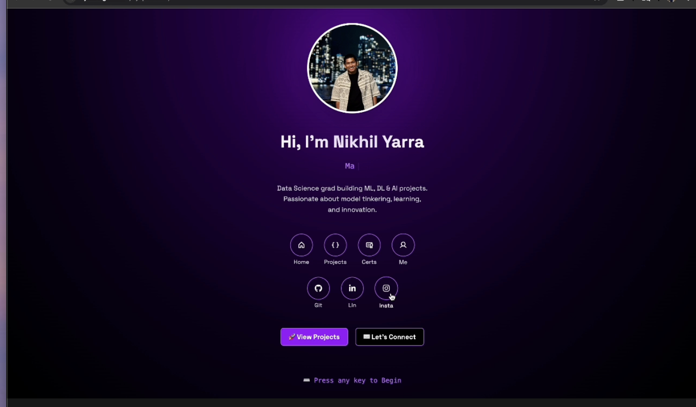
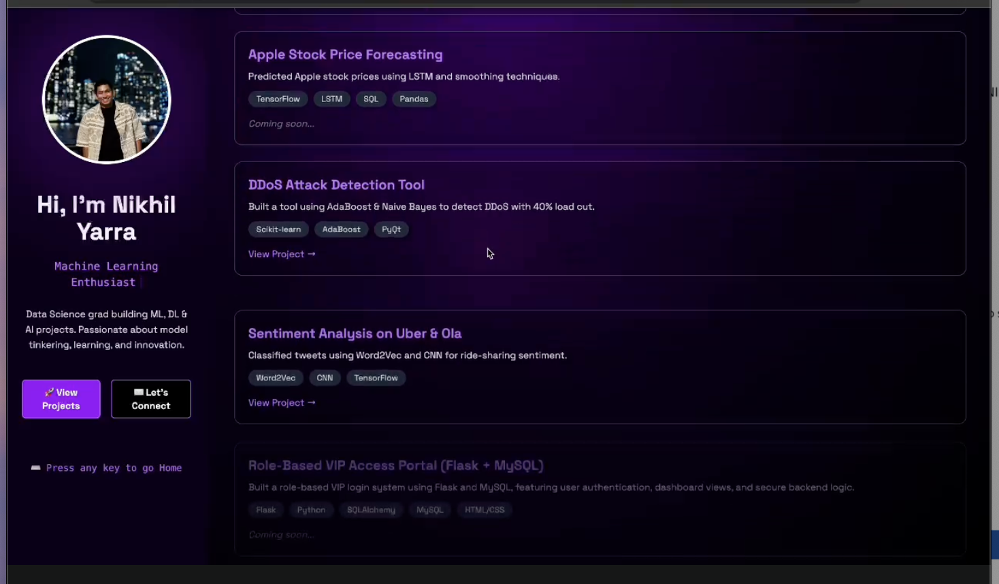

# 🧠 synapshowcase

A vibrant, glowing developer portfolio template built with **React + Vite + Tailwind CSS**.
Designed to showcase your **AI/ML projects, certifications, and developer journey** in a cinematic retro-futuristic style.

Originally crafted by [Nikhil Yarra](https://github.com/nymav), this template captures the energy of gaming aesthetics with practical sections for recruiters, collaborators, and tech enthusiasts.

---

## 🌟 Features

* 🎮 Game-style intro with custom cursor and glow effects
* 🚀 Smooth section transitions (Home, Projects, About, Certifications)
* 🎓 Certification cards with platform icons (Coursera, Forage, etc.)
* 💡 Dark-themed UI with minimalistic, neon glow touches
* ⚡️ Built with **Vite**, **React**, and **Framer Motion**
* 📱 Fully responsive & mobile-ready

---

## 🗀️ Screenshots

| Home & Projects                 | Certifications                                      |
| ------------------------------- | --------------------------------------------------- |
|  |  |

> *More screenshots will be added soon.*

---

## 📁 Folder Structure

```bash
synapshowcase/
├── public/                 # Static assets (icons, images, etc.)
├── src/
│   ├── components/         # Navbar, MobileMenu, LoadingScreen
│   ├── components/sections/
│   │   ├── Home.jsx
│   │   ├── Projects.jsx
│   │   ├── Certifications.jsx
│   │   ├── About.jsx
│   │   ├── SocialBar.jsx
│   │   └── CursorSpotlight.jsx
│   ├── data/               # JSON or static data
│   ├── App.jsx             # Main app wrapper
│   └── main.jsx            # Vite entry point
├── dist/                   # Auto-generated build output
├── index.html              # Root HTML
├── vite.config.js          # Vite configuration
├── .gitignore
└── README.md
```

---

## 🚀 Getting Started

### 1. Clone the repo

```bash
git clone https://github.com/nymav/synapshowcase.git
cd synapshowcase
```

### 2. Install dependencies

```bash
npm install
```

### 3. Run the dev server

```bash
npm run dev
```

Then open [http://localhost:5173](http://localhost:5173) in your browser.

---

## 🧪 Build for Production

```bash
npm run build
```

Output files will be in the `dist/` folder.

---

## ✏️ Customization

* Update profile picture in `public/`
* Edit `src/components/sections` to update sections like Home, Projects, About
* Customize colors and animation in `App.css` and `index.css`
* Replace data in `src/data/` or props

---

## 🌐 Deployment

Easily deploy using:

* **Vercel**
* **Netlify**
* **GitHub Pages** (with Vite adapter)

> Need help deploying? I can provide a `vercel.json` or `gh-pages` guide on request.

---

> Built to impress. Made to inspire. Welcome to your **synapshowcase**.
